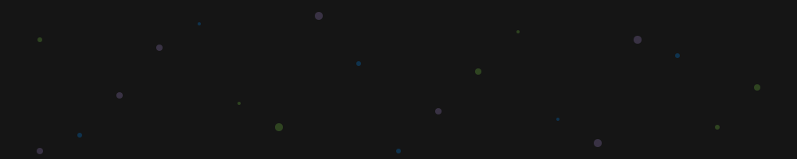

<h1 align="center">Hola a todos, soy Pau Egea! 👋</h1>

  
  
   
  
  

   

  

    

  ## 🚀 Ingeniero Full Stack | Arquitecto de Automatización con IA
  
  

    <b>Transformando procesos de horas en segundos.</b> Especialista en integrar <b>IA Generativa (Gemini API)</b> 
    en flujos de trabajo empresariales complejos, garantizando el cumplimiento de la <b>RGPD</b>. 
    Desarrollador políglota capaz de navegar desde el bajo nivel hasta arquitecturas modernas de alto rendimiento.
  

  

---

### 🌟 Proyecto Destacado: Agente de Decisión con IA (Privado)

He desarrollado un sistema integral de **procesamiento inteligente de peticiones** que escala la eficiencia operativa:

* **Flujo Automático:** Ingesta de correos -> Validación de datos -> Análisis con **Gemini AI**.
* **Privacidad Nativa:** Filtrado y anonimización de datos sensibles bajo normativa **RGPD**.
* **Resultados:** Automatización de autorizaciones o generación de reportes con información crítica para gestores humanos.
* **Impacto:** Reducción de tiempos de respuesta de **3 horas a menos de 5 segundos**.

---

### 🛠️ Mi Ecosistema Tecnológico

#### 🤖 IA & Cloud

  
  
  

#### 🖥️ Backend & Arquitectura

  
  
  
  
  

#### 🌐 Frontend & Performance

  
  
  
  

---

### 📊 Estadísticas de GitHub

  
  

---

### 📫 Conectemos

  
  

   
  

